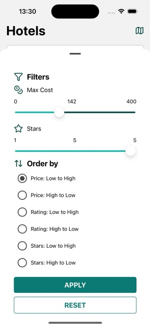

# RNHotels

## Setup Guide
The project has been tested with an ios emulator.
Node version 22.17.0
RN version 0.80


```
git clone https://github.com/igferal/rn-hotels.git
cd rnhotels
npm install 
npx pod-install 
npm run ios
```

## Project structure

```
src/                          # Main source directory
├── api/                      # UseHotels hook to download hotels json.
├── types/                    # TypeScript type definitions
│   ├── index.ts              # Main types (Hotel)
├── ui/                       
│   ├── components/           # UI Components
│   ├── screens/              # Screen components
│   └── navigation/           # Navigation configuration         
│   └── theme/                # Theme configuration         
├── utils/                    # Utility functions, such as filters and sorting
├── i18n/                     # Internationalization
│   └── languages/            
└── tests/                    # Test files and configurations
    ├── components/           # Component tests
    ├── screens/              # Screen tests
    ├── e2e/                  # Simple e2e flow 
    
```


## Libraries

The following 3rd party libraries have been used 

* React Native Navigation & dependencies
    * Navigation between screens
* react-i18next 
    * I18n
* react-native-svg & lucide-react-native
    * Used in icons across all the screens
* @gorhom/bottom-sheet
    * Better ux component with filter options
* @react-native-community/slider
    * Cost filter
* react-native-maps
    * Hotel location component in Detail Screen
* @shopify/restyle
    * Reusing theme across the app.
* react-native-radio-buttons-group
    * Choose just one sorting in the filters and sort sheet.
* @tanstack/react-query
    * There's no api, it's a single json, it could be hardcoded in a ts file exporting an array. But, wrapping the json call in react-query provides cache, future mantainability and the option to simulate the filters and sorting easily.


## User Guide

 

From the Main Screen you can see the hotels at a glance. For each hotel you have easy visibility of the name, location, stars, cost per night and user rating.



From the main screen you can also acces the filters sheet where you can search hotels until a certain cost threshold, maximu starts, or sorting them.


When you touch in a hotel card you are redirected to the hotel detail screen.

Here you have the rest of the information avialable to the hotel

* Check-in and Check-out times
* Hotel location with map preview
* Contact information (touching both email and phone opens mail or phone app)
* Image gallery (trivial implementation where you change the header image)


### Testing

## Components and screens

Simple testing provided by jest and react-native-testing libraries, run with `npm run test`

## e2e

Very basic e2e testing with maestro, [(Install Guide)](https://github.com/mobile-dev-inc/maestro-docs/blob/main/getting-started/installing-maestro/README.md), with the app already installed and the emulator running just run `npm run e2e`